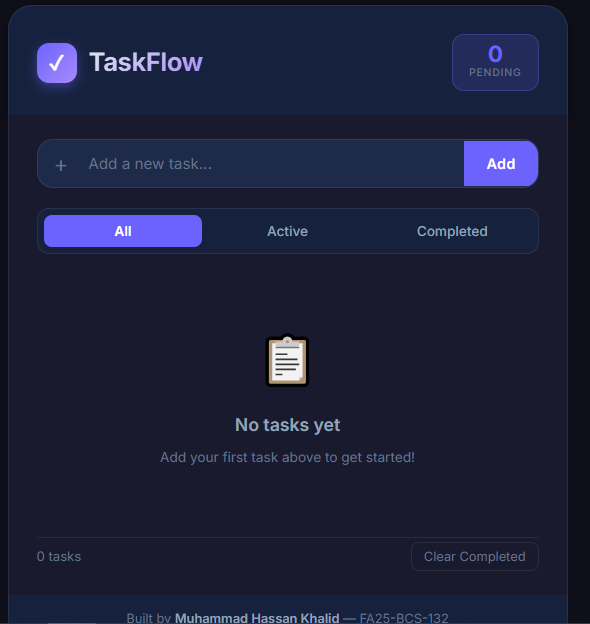
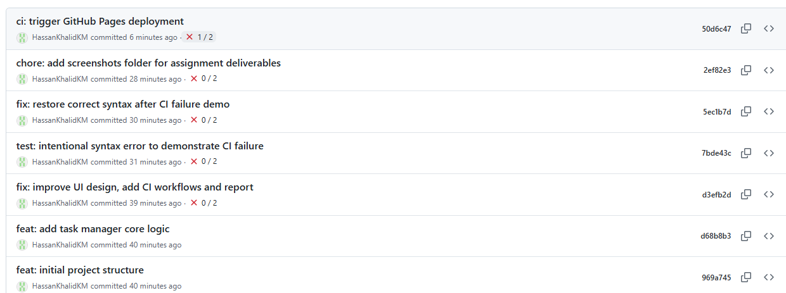
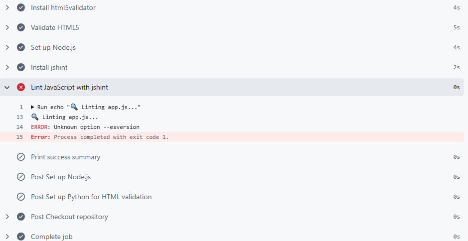
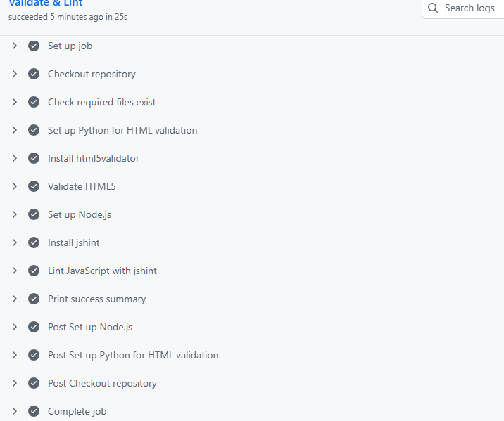
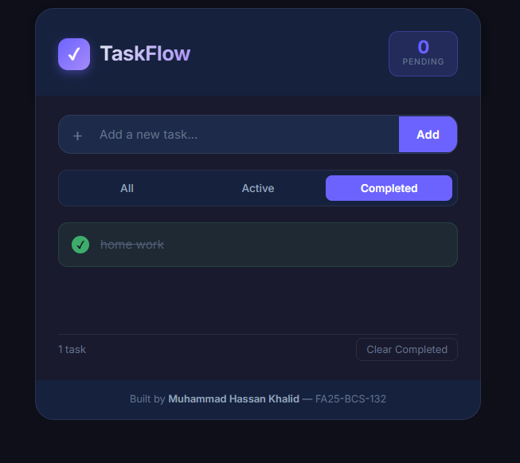

# SE Assignment 01 — Report
## CI/CD Pipeline with GitHub Actions

| | |
|---|---|
| **Student** | Muhammad Hassan Khalid |
| **Roll No.** | FA25-BCS-132 |
| **Subject** | Software Engineering |
| **Assignment** | 01 — Build, Commit, CI/CD, Deploy |
| **Repository** | https://github.com/HassanKhalidKM/se-assignment-01 |
| **Live App** | https://hassankhalidkm.github.io/se-assignment-01/ |
| **Date** | September 2026 |

---

## 1. Application Overview

**TaskFlow** is a single-page Task Manager web application built with pure HTML5, CSS3, and Vanilla JavaScript — no frameworks or external dependencies.

### Features
- Add, complete, and delete tasks
- Filter tasks by status (All / Active / Completed)
- Persistent storage using the browser's `localStorage` API
- Live pending-task badge in the header
- Accessible markup with ARIA roles and labels
- Fully responsive (mobile + desktop)

### Design Decisions
- **No framework** chosen intentionally — keeps the CI pipeline simple and demonstrates core web skills
- **Dark theme** using CSS custom properties for easy theming
- **ES5-compatible JS** (with some ES6 features) to satisfy `jshint --esversion=8`

---

## 2. Git Workflow & Commit History

Three meaningful commits were made following conventional commit style:

| # | Commit Message | What Changed |
|---|---|---|
| 1 | `feat: initial project structure` | `index.html` skeleton + `README.md` |
| 2 | `feat: add task manager core logic` | `app.js` — CRUD, localStorage, filtering |
| 3 | `fix: improve UI design and accessibility` | `style.css` — full design, ARIA, responsive |

Each commit represents a logical, independently reviewable unit of work.

---

## 3. GitHub Actions CI Pipeline

The CI workflow lives at `.github/workflows/ci.yml` and runs automatically on every push to `main` and every pull request targeting `main`.

### Pipeline Steps

```
push to main
     │
     ▼
┌─────────────────────────────────┐
│   CI — Build & Test             │
│                                 │
│  1. Checkout repository         │
│  2. Check required files exist  │
│     - index.html ✓              │
│     - style.css  ✓              │
│     - app.js     ✓              │
│     - README.md  ✓              │
│  3. Validate HTML5              │
│     (html5validator via pip)    │
│  4. Lint JavaScript             │
│     (jshint via npm)            │
│  5. Print success summary       │
└─────────────────────────────────┘
     │
     ▼ (if on main branch)
┌─────────────────────────────────┐
│   Deploy — GitHub Pages         │
│                                 │
│  1. Checkout repository         │
│  2. Configure Pages             │
│  3. Upload site artifact        │
│  4. Deploy to Pages             │
└─────────────────────────────────┘
```

### Why These Checks?
- **File presence check** — ensures no developer accidentally deletes a critical file
- **HTML5 validation** — catches malformed markup that could break the page
- **JS linting** — catches syntax errors and undefined variable usage before they reach production

---

## 4. Break-and-Fix Demonstration

### Step A — Deliberate Break
A syntax error was introduced in `app.js`:

```javascript
// BROKEN: missing closing parenthesis
function loadTasks( {
  var stored = localStorage.getItem(STORAGE_KEY);
```

This was committed and pushed as:
> `test: intentional syntax error to demonstrate CI failure`

**Result:** The CI pipeline failed ❌ on the "Lint JavaScript" step.

📸 *[See screenshot: ci_failed.png]*

### Step B — Fix
The syntax error was corrected and pushed as:
> `fix: restore correct syntax after CI failure demo`

**Result:** The CI pipeline passed ✅ on all steps.

📸 *[See screenshot: ci_success.png]*

---

## 5. GitHub Pages Deployment

The deployment workflow at `.github/workflows/deploy.yml` runs automatically after every push to `main`. It uses the official GitHub Pages Actions (`configure-pages`, `upload-pages-artifact`, `deploy-pages`) to publish the repository root as a static site.

**Live URL:** https://hassankhalidkm.github.io/se-assignment-01/

---

## 6. Screenshots

### Local Application Execution


### Git Commit History (3+ Meaningful Commits)


### CI Pipeline Failure (Intentional Error Demonstration)


### CI Pipeline Success (Fixed Workflow)


### GitHub Pages Live Deployment


---

## 7. Reflection

### New Territory (Steps 6–9)
GitHub Actions was the genuinely new part of this assignment. Key lessons learned:

1. **YAML indentation matters** — a misplaced space breaks the entire workflow
2. **Workflow triggers** — `on: push: branches: [main]` vs also triggering on PRs
3. **Actions marketplace** — using pre-built actions (`checkout@v4`, `setup-node@v4`) avoids rewriting boilerplate
4. **Reading CI logs** — the collapsed step logs show exactly which command failed and why
5. **Secrets and permissions** — GitHub Pages deployment requires `permissions: pages: write` in the workflow YAML

### What I Would Add Next
- Unit tests with Jest (requires a small `package.json`)
- Code coverage reporting
- Lighthouse performance audit step
- Slack/email notifications on failure

---

*Report submitted as part of SE Assignment 01 — September 2026*
