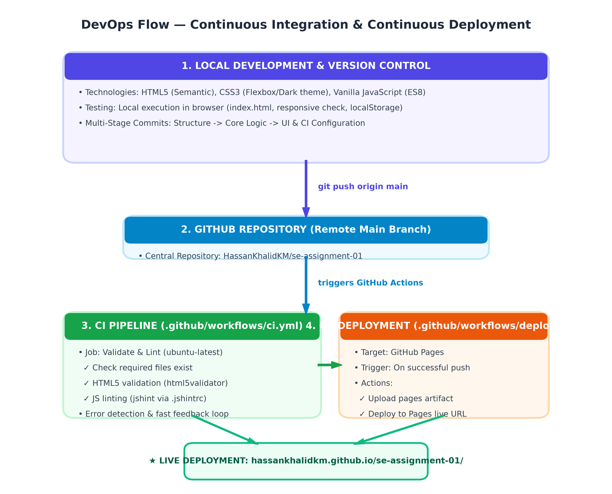
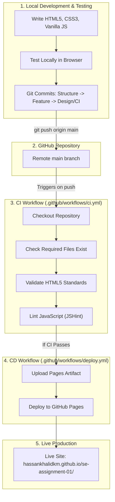

# Assignment 01 — Build and Deploy a Small Application
## Software Engineering (DevOps & CI/CD)

| Field | Detail |
|---|---|
| **Student Name** | Muhammad Hassan Khalid |
| **Roll Number** | FA25-BCS-132 |
| **Assignment** | Assignment 01: Build and Deploy a Small Application |
| **Course** | Software Engineering |
| **GitHub Repository** | [https://github.com/HassanKhalidKM/se-assignment-01](https://github.com/HassanKhalidKM/se-assignment-01) |
| **Live Deployed App** | [https://hassankhalidkm.github.io/se-assignment-01/](https://hassankhalidkm.github.io/se-assignment-01/) |

---

## 1. Application Name and Purpose

- **Application Name:** TaskFlow
- **Category:** To-Do List Application (Option 1 from assignment sheet)
- **Purpose:**  
  TaskFlow is a client-side productivity tool designed to help users organize, prioritize, and monitor their daily tasks and activities. It operates with zero third-party dependencies using pure modern web standards, providing instant startup, high accessibility, responsive design, and persistence across browser sessions.

---

## 2. Main Features

- **Task Creation:** Add tasks instantly via input field and `Enter` key or `Add` button.
- **Task Completion Toggle:** Mark tasks as completed or active with animated visual strike-through.
- **Task Deletion:** Delete individual tasks or bulk-clear completed tasks.
- **Filter Views:** Filter tasks dynamically by **All**, **Active**, or **Completed** tabs.
- **Persistent Storage:** Synchronizes with browser `localStorage` so tasks remain saved upon page reload or browser restart.
- **Real-time Metrics:** Live badge count displaying remaining active tasks in the header.
- **Accessibility & Responsiveness:** Built using semantic HTML5 elements, ARIA attributes (`aria-label`, `aria-pressed`, `aria-live`), and fully fluid CSS for desktop and mobile displays.

---

## 3. DevOps Flow Followed

The project implemented an automated end-to-end DevOps pipeline through GitHub:

---

## 4. Problems Faced and How They Were Solved

1. **GitHub Actions Linting False Positives (`jshint` configuration):**
   - *Problem:* Running `jshint` with strict CLI flags flagged browser globals (`localStorage`, `document`) as undefined variables.
   - *Solution:* Created a dedicated `.jshintrc` configuration file that explicitly defines ES8 environment support and registers browser runtime globals.

2. **Demonstration of CI Failure (Step 9 Requirement):**
   - *Problem:* Intentionally introducing a syntax error (`var broken = (;`) to break the build, while maintaining ability to restore functionality cleanly.
   - *Solution:* Created an intentional failure commit (`test: intentional syntax error to demonstrate CI failure`), verified that the GitHub Actions run failed on the lint step, captured evidence, and subsequently pushed a clean fix commit (`fix: restore correct syntax after CI failure demo`).

3. **GitHub Pages Deployment via Actions:**
   - *Problem:* Default repository settings expected deployment from a branch rather than GitHub Actions artifacts.
   - *Solution:* Configured repository settings (Pages -> Source -> GitHub Actions) and granted workflow permissions (`pages: write`, `id-token: write`) in `deploy.yml`.

---

## 5. What You Learned from Continuous Integration (CI)

1. **Automated Quality Gates:** CI guarantees that bad code, broken markup, or syntax errors never reach production unnoticed. Every push is verified automatically in an isolated runner environment.
2. **Fast Feedback Loop:** Developers receive instant notifications within minutes of pushing code, showing the exact command and line number where a failure occurred.
3. **Reproducible Environments:** CI workflows run on standardized clean containers (`ubuntu-latest`), eliminating the "it works on my machine" problem.
4. **Separation of CI and CD:** Clear separation between validating/testing code (CI) and deploying the validated artifact to production hosting (CD).

---

## 6. Required Deliverables & Screenshots

### Deliverable Links
- **GitHub Repository:** [https://github.com/HassanKhalidKM/se-assignment-01](https://github.com/HassanKhalidKM/se-assignment-01)
- **Live Deployed Application:** [https://hassankhalidkm.github.io/se-assignment-01/](https://hassankhalidkm.github.io/se-assignment-01/)

---

### Screenshot 1: Running Application (Local)

---

### Screenshot 2: GitHub Repository Files

---

### Screenshot 3: Commit History (3+ Meaningful Commits)

---

### Screenshot 4: Failed CI Workflow (Intentional Error Demonstration)

---

### Screenshot 5: Successful CI Workflow (Error Resolved)

---

### Screenshot 6: Deployed Application (Live on GitHub Pages)

